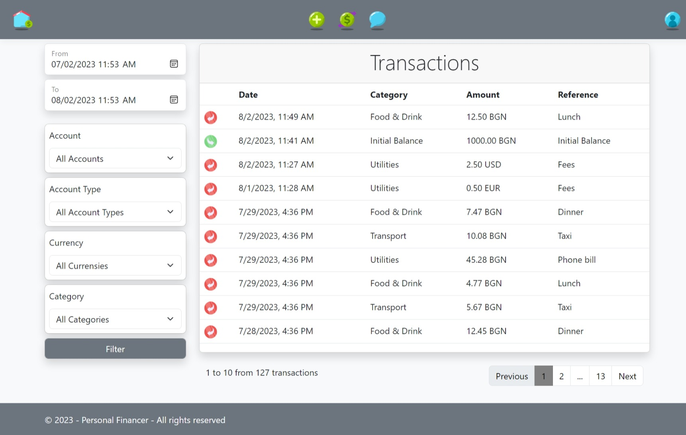
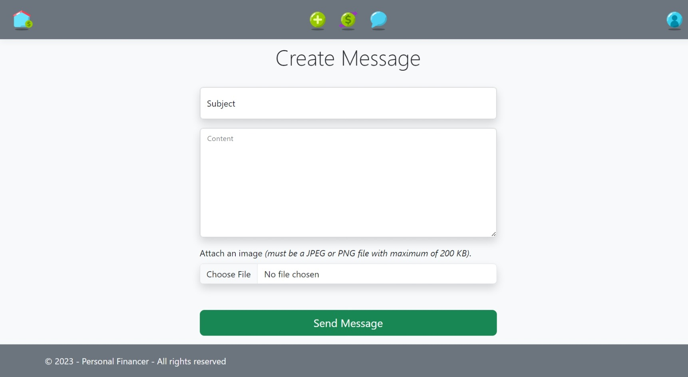
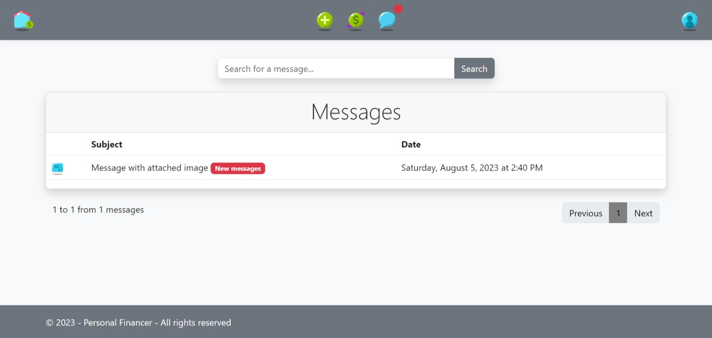
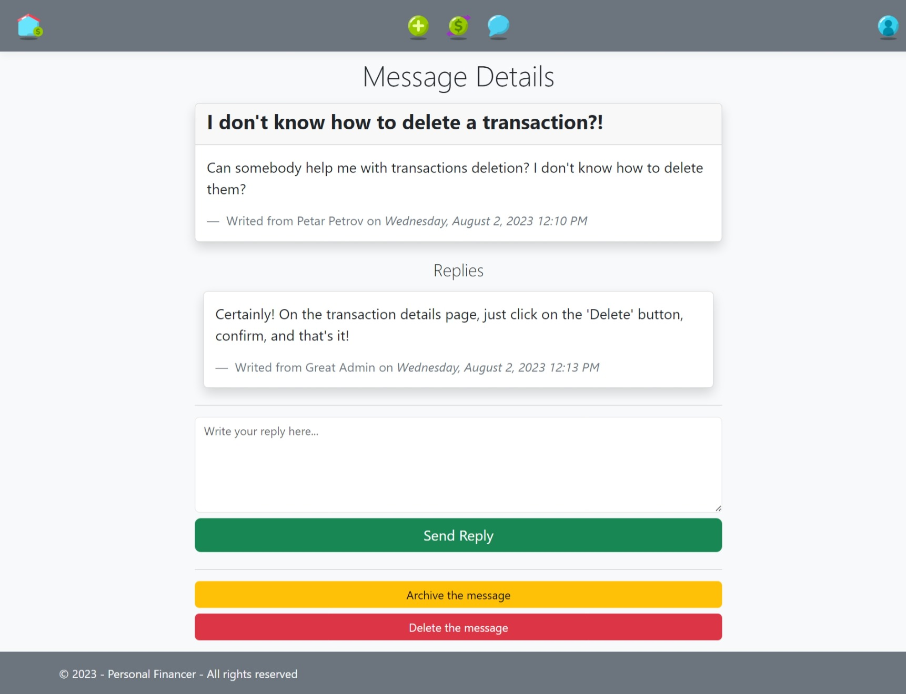
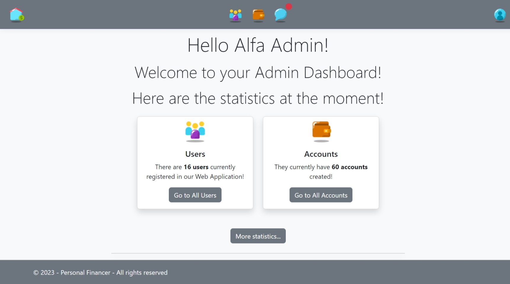
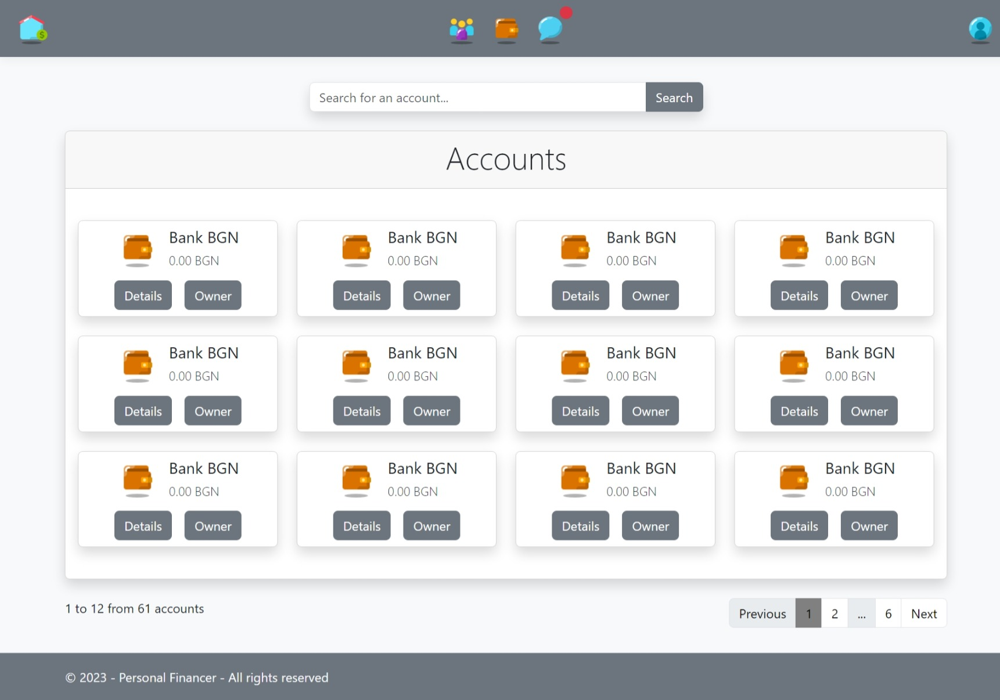

# Personal Financer

## Link to the App: <a href='https://financer.azurewebsites.net/'><b>financer.azurewebsites.net</b></a>
You can use user with test data - email: petar@mail.com, password: petar123

## Overview
Personal Financer is a web application that provides its users with the ability to record their incomes and expenses structured into accounts and transactions.

## Motivation
I created this project to practice my skills, and it will also serve as my defense project for the [**ASP.NET Advanced**](https://softuni.bg/trainings/4107/asp-net-advanced-june-2023) course at [SoftUni](https://softuni.bg/ "SoftUni") (June 2023).

## Used Tech/Frameworks
- ASP.NET Core 6
    - MVC
    - Web API
    - SendGrid
    - AutoMapper
    - Cache in-memory
    - TempData messages
    - Moq
    - NUnit
    - Bootstrap
    - HTML5 Canvas
- JavaScript for AJAX requests and DOM manipulations
- Entity Framework Core
- Microsoft SQL Server
- MongoDB (for Messages)

## How to Run the Project

The Project can be easy tested locally. All you need to do:
1. Populate the appsettings.json file with the required configurations;
2. That's it! Run the App & Enjoy! :)

When the App is fired up its will seed the Database with: 
- Admin - email: admin@admin.com, password: admin123
- User with accounts and transactions for easy and fast tests - email: petar@mail.com, password: petar123

## Database Diagram

## Features

- [Create, edit and delete accounts, account types and currencies](#accounts-with-type-and-currency)
- [Create, edit and delete transactions and categories](#transactions-with-category)
- [User Dashboard](#user-dashboard)
- [All Transactions page](#all-transactions-page)
- [Messages](#messages)
- [User Roles](#user-roles)
- [Responsive design](#responsive-design)

Personal Financer is a website for recording your cash flow and analyzing it.

[Back to Features <<](#features)

### Accounts with Type and Currency

You can create your own accounts with name, balance, account type and currency.

When you click on 'Create New Account Type' or 'Create New Currency', you can create your own account types and currencies. If the 'Delete' buttons are clicked, the selected account type or currency will be deleted after confirmation. This feature utilizes AJAX and Web APIs.

When an account is created, you will be redirected to the new Account Details page. The Personal Financer app automatically creates an Initial Balance Transaction with the amount provided as the Account Balance by you.

The Details page provides options to Edit and Delete the account, filter transactions for a given period, and display them on separate pages, with 10 transactions per page. The page navigation is handled through AJAX requests and Web APIs on the backend.

On the Edit Account page, you can change the name, balance, account type, and currency of the account. When you change the balance of the account, the app will automatically update the Initial Balance Transaction or create it if the account was initially created with a zero balance. This ensures that all incomes and expenses are adjusted to match the new balance.

If you press 'Delete Account', you will be redirected to confirm your decision. You also have the option to delete all transactions related to the account or leave them to remain in your records.

[Back to Features <<](#features)

### Transactions with Category

On the Create Transaction page, you can create a transaction with the following details: amount, date, category, account, transaction type, and payment reference. The app provides an option to add and remove categories, utilizing AJAX and Web API.

When a transaction is created, you will be redirected to the Transaction Details page. There, the app provides options to edit and delete the transaction.

You can change any data on transactions, including the account. This will automatically update the balance on both accounts.

[Back to Features <<](#features)

### User Dashboard

The Dashboard page provides the user with the following information:
- A section displaying the user's accounts;
- The last five transactions made from all accounts;
- Cash flow for the selected period;
- Expenses structure for the selected period.

[Back to Features <<](#features)

### All transactions page

On the All Transactions page, you can manage all of your transactions and filter them by a specific period, for example.

[Back to Features <<](#features)

### Messages

Users can write messages to the support team. Every admin can see users messages and reply to them. Messages can be deleted by both users and admins. They are stored in a separate database (MongoDB).

[Back to Features <<](#features)

### User Roles

Personal Financer has two roles - User and Admin.
Here's what an Admin can do.

An admin can manage all users and their accounts. They can edit and delete accounts and transactions. The administrator has access to information about the number of users and accounts. When the 'More statistics' button on the Home page is pressed, an AJAX request is made to the server to retrieve up-to-date data on the total amount of transactions made by users, grouped by currencies.

[Back to Features <<](#features)

### Responsive design

Personal Financer is responsive and can be comfortably used on different devices.

[Back to Features <<](#features)

[Back in the beginning <<](#personal-financer)