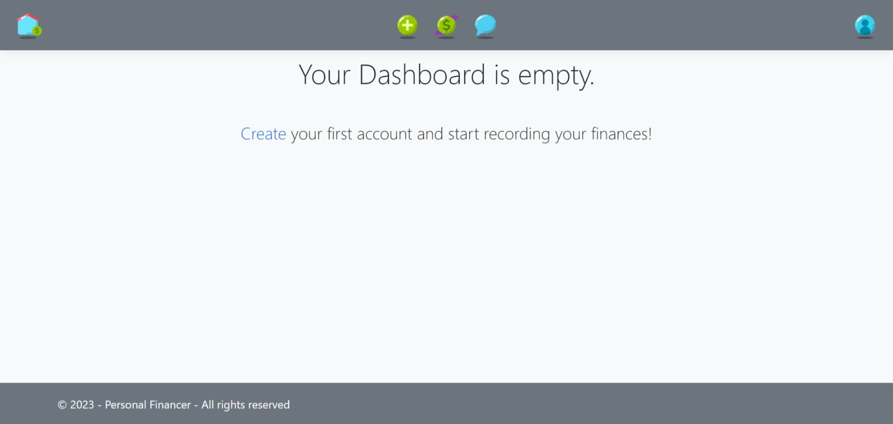
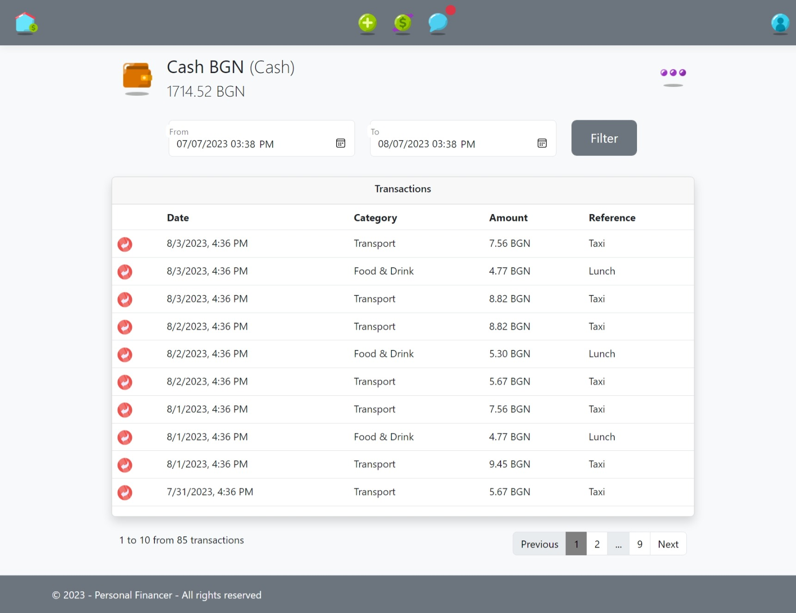
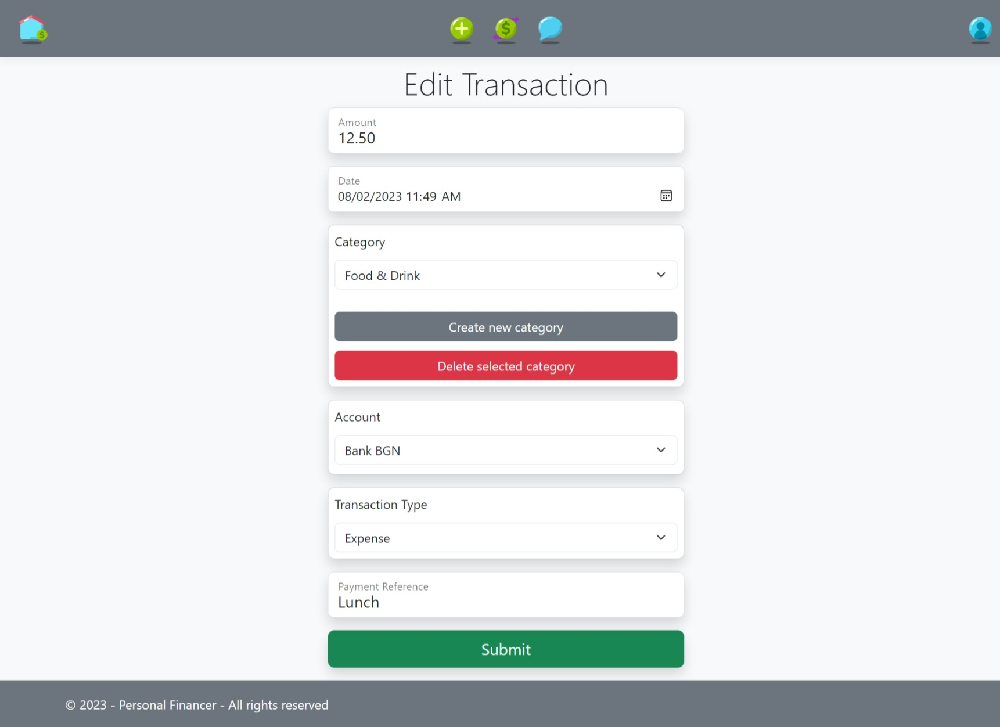
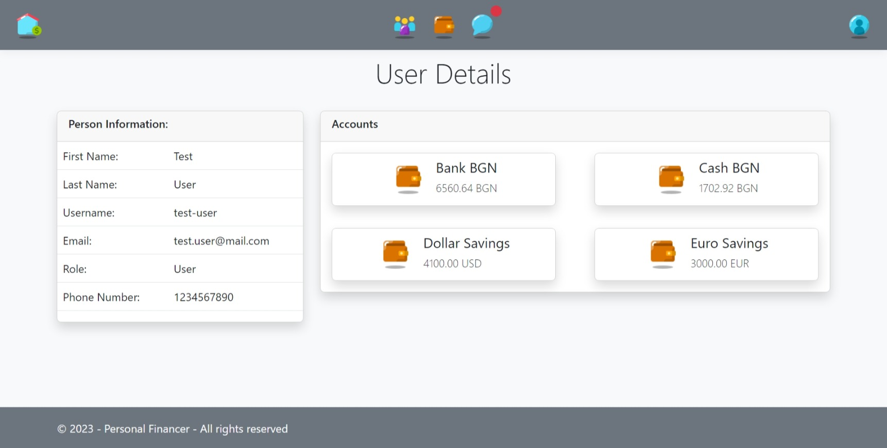
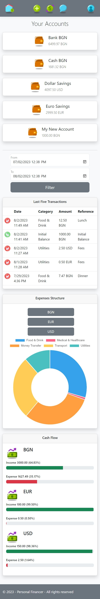
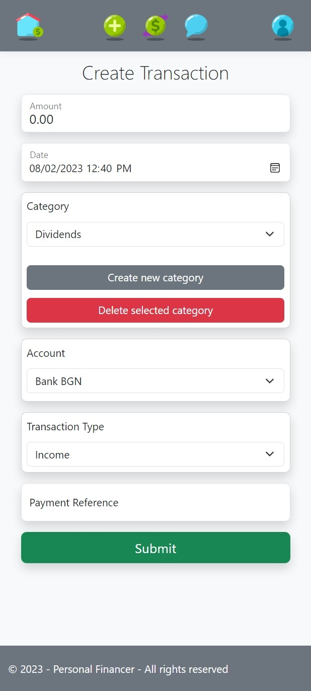

# Personal Financer

## Overview
Personal Financer is Web Application that give on his users the ability to record their incomes and expenses structured on Accounts and Transactions.

## Motivation
This is my first project. I created it to practice my skills and also will be a defense project for [**ASP.NET Advanced**](https://softuni.bg/trainings/4107/asp-net-advanced-june-2023) course at [SoftUni](https://softuni.bg/ "SoftUni") (June 2023).

## Used Tech/Frameworks
- ASP.NET Core 6
    - Database layer with 6 entity models
    - UI layer with 4 controllers + 4 more in the "Admin" area
    - Web API with 7 controllers for RESTful services
    - Service layer with 3 services
    - 16 views + 5 partial views
    - Client and Server validations 
    - AutoMapper
    - Cache in-memory
    - TempData messages
- JavaScript for AJAX requests and DOM manipulations
- Entity Framework Core
- Microsoft SQL Server
- NUnit

## How to Install and Run the Project
The Project can be easy tested. All you need to do:
1. Create appsettings.json file with connection string;
3. Run the App & Enjoy! :)

The Migration will seed the Database with: 
- Admin - email: admin@admin.com, password: admin123
- User with accounts and transactions for easy and fast tests - email: petar@mail.com, password: petar123

## Features
Personal Financer is a website for record your cash flow and analyze it. To use the application you must login or create a registration.

You can create your own Accounts with Name, Balance, Account Type and Currency.

When click on 'Create New Account Type' or 'Create New Currency' you can create or delete your own Account Types and Currencies. If 'Delete' buttons are clicked selected Account Type or Currency will be deleted after confimation. (This feature use AJAX and Web APIs)

When Account is created you will be redirected to the new Account Details page. Personal Financer App automatically made Initial Balance Transaction with Amount gived as Account Balance from you.

Details page gives options for Edit and Delete Account, filter transactions for given period and shows them on separated pages by 10 on each one. Pages are changed again with AJAX requests and Web APIs on backend.

On Edit Account page you can change Name, Balance, Account Type and Currency of the account. 

When you change Balance of the account, the App automatically will change the Initial Balance Transaction or create it, if the account was created with zero balance, so all incomes and expenses to be equal to the new balance.

If you press 'Delete Account' you will be redirected to confirm your decision. You have option also to delete all transactions releated with the account or leave then to stay on your records.

On Create Transaction page you can create transaction with Amount, Date, Category, Account, Transaction Type and Payment Refference.
The App gives an option for adding and removing Categories (again with AJAX and Web API).

When Transaction is created you will be redirected to Transaction Details page. There the App gives an options for Edit and Delete transaction.

You can change everything on transactions data including the Account. That will automatically change Balance on both accounts.

On All Transactions page you can manage all of yours transactions. Filter them by specific period e.g.

Personal Financer has a two roles - User and Admin.
Here what Admin can do.

Admin can manage all users and their accounts. He can Edit and Delete accounts and transactions. The Administrator has information about the number of users and accounts. When press "More statistics" button on Home page makes AJAX request and receive more fresh data from the server about amount of all transactions maded by users grouped by currencies.

Personal Financer is responsive - can be used comfortable on different devices.

